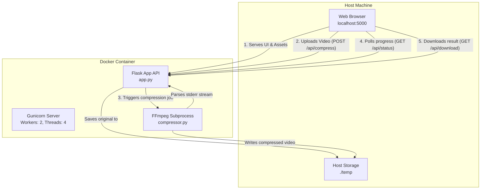

# Video Compressor

A lightweight, containerized web application designed to compress video files locally without requiring internet uploads. It uses a modern web frontend paired with a Python (Flask) backend that securely orchestrates FFmpeg subprocesses within a Docker container.

## 🚀 Getting Started

### Prerequisites
- [Docker Desktop](https://www.docker.com/products/docker-desktop/) installed and running.

### Installation & Run

1. Clone or download this repository.
2. Open a terminal in the project directory.
3. Build and start the container:
   ```bash
   docker compose up --build -d
   ```
4. Open your browser and navigate to: **[http://localhost:5000](http://localhost:5000)**

## 🛠️ Technology Stack

| Component | Technology | Purpose |
|:---|:---|:---|
| **Frontend UI** | HTML5, Vanilla JS, CSS3 | Clean, modern, responsive user interface. No bulky frontend frameworks, ensuring maximum performance and instant load times. |
| **Backend API** | Python 3.12, Flask | Lightweight web framework handling file uploads, API routing, and FFmpeg process management. |
| **Application Server** | Gunicorn | Production-grade WSGI HTTP Server to serve the Flask app, configured with multiple threads to handle large video uploads seamlessly. |
| **Video Engine** | FFmpeg | The core compression engine. Handles format conversion, resolution scaling, bitrate capping, and audio processing. |
| **Containerization** | Docker, Docker Compose | Bundles the application, Python runtime, and FFmpeg binary into a single, portable, isolated environment. |

---

## 🏗️ System Architecture

The application operates on a client-server architecture, but heavily optimized for running on a single local machine via Docker.



### Component Breakdown

#### 1. Frontend Client (`web/`)
- **`index.html` & `style.css`**: Provides a beautifully designed, desktop-like UI. Features a drag-and-drop zone, adjustable compression sliders, and real-time progress overlays.
- **`main.js`**: The brains of the frontend. It intercepts file drops, handles large form-data uploads via `XMLHttpRequest` (to track upload progress), and continuously polls the backend API for FFmpeg encoding progress.

#### 2. Flask Backend (`app.py`)
- Acts as the orchestrator.
- Receives file uploads and saves them immediately to the `temp/uploads` directory.
- Maps user settings (from basic sliders or advanced inputs) to corresponding FFmpeg arguments.
- Maintains an in-memory dictionary of active jobs, allowing the frontend to poll for real-time status and speed metrics.

#### 3. Compression Engine (`compressor.py`)
- **Hardware Encoder Detection**: Upon startup, probes for available hardware encoders (`h264_nvenc`, `h264_qsv`, `h264_amf`). If none are available (default behavior in standard Docker), it falls back to `libx264` software encoding (`veryfast` preset).
- **Subprocess Management**: Spawns FFmpeg in a background thread using `subprocess.Popen`. 
- **Real-time Parsing**: Crucially uses Universal Newlines (`text=True`, `bufsize=1`) to parse FFmpeg's carriage-return (`\r`) log stream in real-time, extracting `time=` and `speed=` to calculate the percentage completed based on the total video duration.
- **Bitrate Enforcement**: In basic mode, calculates a maximum allowed video bitrate based on the user's requested megabyte size, and enforces it strictly using FFmpeg's VBV limits (`-maxrate` and `-bufsize`) to guarantee the file never exceeds the target size.

#### 4. File Storage (`temp/`)
To prevent the Docker container's internal filesystem from bloating, the `temp/` folder is mounted as a volume to the host machine. 
- `temp/uploads/`: Temporarily stores the raw video.
- `temp/output/`: Temporarily stores the compressed video until the user downloads it.
- **Auto-Cleanup**: The backend automatically deletes input files upon successful compression, and sweeps the directories on application startup to handle any orphaned files.

---

## 🚀 Key Workflows

### The Compression Lifecycle

1. **User Request**: User drops a video and selects a target size (e.g., 44 MB) and clicks compress.
2. **Upload**: Browser uploads the video to `/api/compress`.
3. **Calculation**: 
   - `app.py` generates a unique `uuid` for the job.
   - `compressor.py` calculates the exact video bitrate required: `(Target Size in bits / Duration) - Audio Bitrate`.
4. **Execution**: FFmpeg is launched with strict maximum bitrate constraints:
   ```bash
   ffmpeg -y -i input.mp4 -c:v libx264 -preset veryfast -b:v {calc_bitrate}k -maxrate {calc_bitrate}k -bufsize {calc_bitrate*2}k -c:a aac output.mp4
   ```
5. **Monitoring**: The frontend polls `/api/status/<job_id>` every 400ms. Python reads FFmpeg's stderr, parses the current timestamp, and returns a 0-100% progress integer.
6. **Delivery**: Upon completion, the frontend displays the final sizes and the user downloads the file via `/api/download/<job_id>`.
